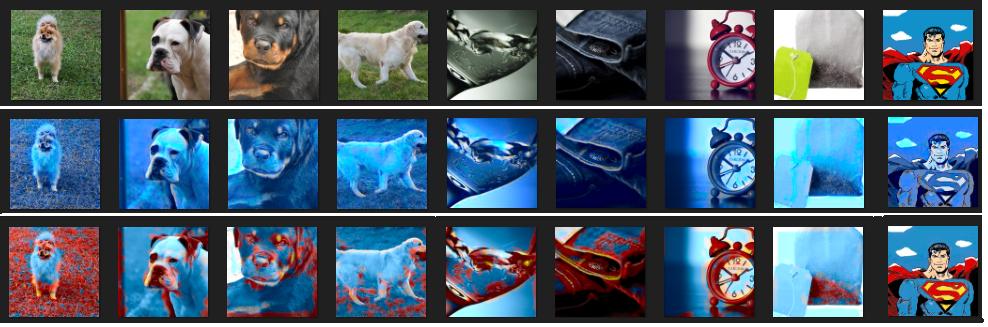

# Color black and white images

#### Without using pre trained model like ResNet 50, VGG-16 and such, it is somewhat difficult to colorize black and white or grayscale images. The model just outputs the few learnt colors (11-128) out of the 16.5Million colors in the RGB space on the pictures. 

#### This struck to me as the idea for a neural style transfer sort of demo, which is what this quest for coloring images came to be. Also using GAN can solve this problem, maybe i will try that out in the future,but for now this will suffice. :)

### Here is what the model produces :

